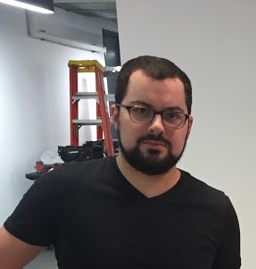

<h2 align="center">Howdy, I'm James.</h2>

  

  

<i>The best picture of me with a ladder.</i>

I'm a data science software engineer from New Jersey livin' it up in Chicago because I love being cold.

#### :sleeping_bed: My fav things to do are:

- Python
- Math
- Data Analytics
- `~*just devops-y things*~`
- Side projects I start, don't finish, then delete the repo 2 years later
- The Legend of Zelda: A Link to the Past Randomizer. Look this up, it's real fun.
- I bike around town sometimes.

#### :zzz: What math do I like?

- I studied algebraic topology in grad school which was pretty fun. I love looking at what they're doing with applied topology lately.
- Working through measure theroy stuff via stats is pretty wild; the proofs take me forever, but it's fun.
- Pretty much any proof-based math is fun to dive into. If you got some proof-based stuff you dig, I'll check it out.
  - No one who has claimed to solve Riemann or has a "counterexample" to the Fermat's Last Theorem proof pls

#### :sweat_drops: I'm currently workin' with travel data, doing some data science / data engineering work.

#### :microphone: talk to me!

- :link: LinkedIn: https://www.linkedin.com/in/james-salvatore-4852b181/
